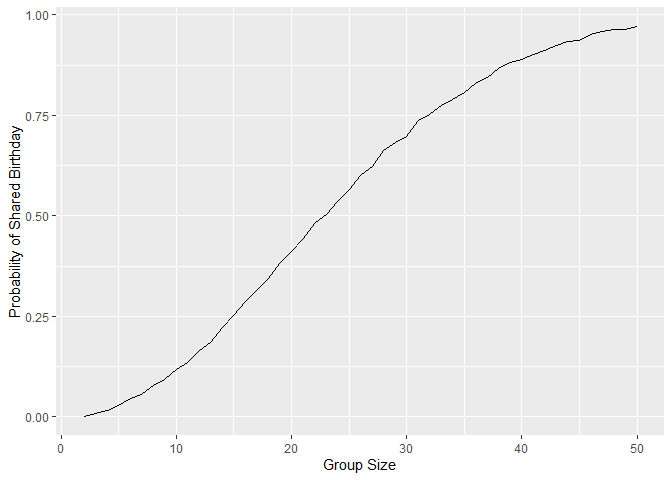

p8105_hw5_tl3279
================
Tianqi Li
2024-11-11

## Problem 1

Setup the function to detect duplicate for birthday.

``` r
bday_sim = function(n) {

  bdays = sample(1:365, size = n, replace = TRUE)
  
  duplicate = length(unique(bdays)) < n
  
  return(duplicate)
}
```

Run this function 10000 times for each group size between 2 and 50. Make
a plot showing the probability as a function of group size, and comment
on your results

``` r
sim_res = 
  expand_grid(
    n = c(2:50),
    iter = 1:10000
  ) |>
  mutate(res = map_lgl(n,bday_sim)) |>
  group_by(n) |>
  summarize(prob = mean(res))

sim_res |>
  ggplot(aes(x = n, y = prob)) +
  geom_line() +
  labs(x = "Group Size", y = "Probability of Shared Birthday")
```

<!-- --> The
probability of at least two people sharing a birthday increases as the
group size grows. The probability starts off close to zero for very
small group sizes but increases rapidly. As the group size approaches
23, the probability increased to about 50%. For larger group sizes, the
probability approaches 1, indicating near certainty that at least two
people will share a birthday.
